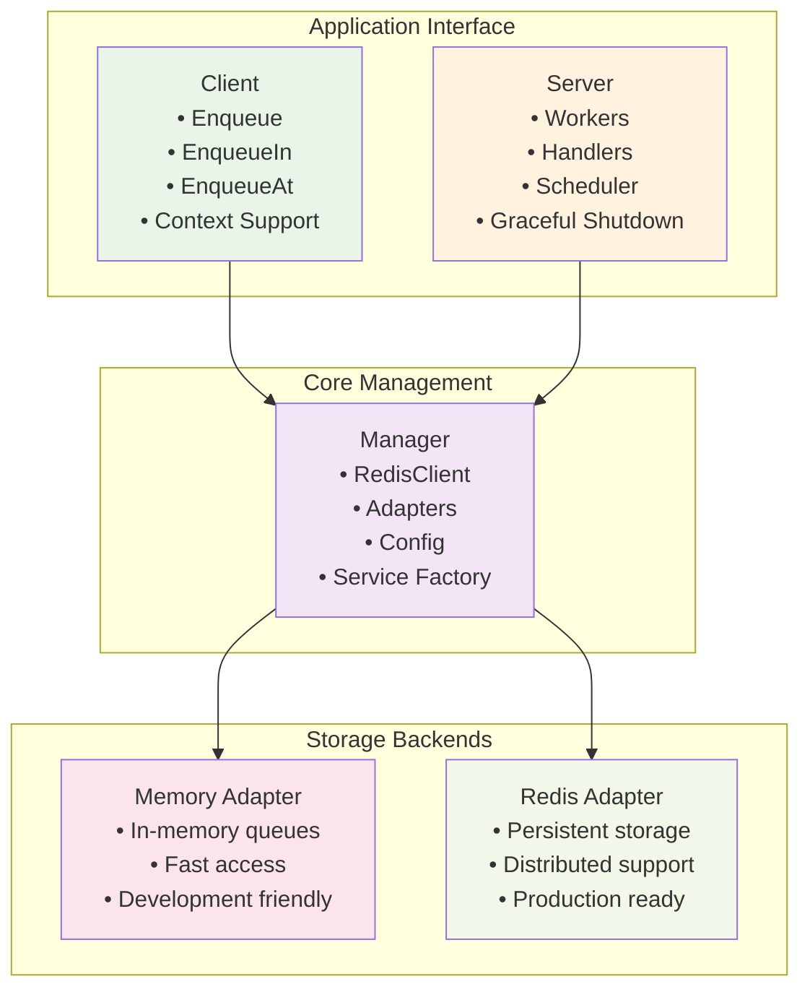

# Go Queue - Thư viện hàng đợi mạnh mẽ cho Go

Go Queue là một thư viện hàng đợi tác vụ (task queue) hiệu suất cao và linh hoạt được thiết kế cho các ứng dụng Go. Thư viện cung cấp một giải pháp toàn diện cho việc xử lý tác vụ bất đồng bộ với khả năng mở rộng và tích hợp dễ dàng.

## Tính năng chính

### 🚀 Hiệu suất cao
- **Xử lý đồng thời**: Hỗ trợ đa worker để xử lý nhiều tác vụ song song
- **Tối ưu hóa bộ nhớ**: Sử dụng memory pool và connection pooling hiệu quả
- **Polling thông minh**: Khoảng thời gian polling có thể cấu hình

### 🔧 Linh hoạt và có thể mở rộng
- **Multi-adapter**: Hỗ trợ cả Memory và Redis adapters
- **Dependency Injection**: Tích hợp hoàn toàn với hệ thống DI
- **Provider Pattern**: Dễ dàng mở rộng và tùy chỉnh

### ⚡ Xử lý tác vụ nâng cao
- **Scheduled Tasks**: Lên lịch tác vụ để thực hiện vào thời điểm cụ thể
- **Retry Logic**: Cơ chế retry thông minh với backoff
- **Priority Queues**: Hỗ trợ ưu tiên hàng đợi
- **Graceful Shutdown**: Dừng server một cách an toàn

### 🛡️ Tin cậy và bảo mật
- **Error Handling**: Xử lý lỗi toàn diện với logging chi tiết
- **Context Support**: Hỗ trợ đầy đủ Go context cho cancellation
- **Distributed Locking**: Hỗ trợ khóa phân tán cho môi trường cluster

## Kiến trúc tổng quan



**Luồng hoạt động chính:**

1. **Client** gửi tasks thông qua **Manager**
2. **Manager** chọn adapter phù hợp (Memory/Redis) 
3. **Server** với worker pool xử lý tasks từ adapters
4. **Scheduler** quản lý delayed/scheduled tasks
5. **Provider** tích hợp với DI container cho lifecycle management

## Bắt đầu nhanh

### 1. Cài đặt

```bash
go get go.fork.vn/queue
```

### 2. Cấu hình cơ bản

```go
package main

import (
    "context"
    "log"
    
    "go.fork.vn/queue"
)

func main() {
    // Tạo manager với cấu hình mặc định
    config := queue.DefaultConfig()
    manager := queue.NewManager(config)
    
    // Lấy client và server
    client := manager.Client()
    server := manager.Server()
    
    // Đăng ký handler
    server.RegisterHandler("send_email", func(ctx context.Context, task *queue.Task) error {
        var payload struct {
            Email string `json:"email"`
            Subject string `json:"subject"`
        }
        
        if err := task.Unmarshal(&payload); err != nil {
            return err
        }
        
        log.Printf("Sending email to %s: %s", payload.Email, payload.Subject)
        return nil
    })
    
    // Gửi tác vụ
    _, err := client.Enqueue("send_email", map[string]string{
        "email": "user@example.com",
        "subject": "Welcome!",
    })
    if err != nil {
        log.Fatal(err)
    }
    
    // Khởi động server
    if err := server.Start(); err != nil {
        log.Fatal(err)
    }
}
```

### 3. Với Redis

```go
import (
    "github.com/redis/go-redis/v9"
    "go.fork.vn/queue"
)

// Cấu hình sử dụng Redis
config := queue.DefaultConfig()
config.Adapter.Default = "redis"

// Tạo manager với DI container (nếu sử dụng Redis provider)
container := di.NewContainer()
manager := queue.NewManagerWithContainer(config, container)
```

## Cấu trúc tài liệu

- **[Tổng quan](overview.md)** - Hiểu về kiến trúc và các thành phần
- **[Cấu hình](config.md)** - Chi tiết về cấu hình hệ thống
- **[Client](client.md)** - Sử dụng client để gửi tác vụ
- **[Server](server.md)** - Thiết lập và vận hành server
- **[Provider](provider.md)** - Tích hợp với hệ thống DI
- **[Manager](manager.md)** - Quản lý các thành phần hệ thống
- **[Task](task.md)** - Làm việc với tác vụ và xử lý dữ liệu

## Ví dụ sử dụng

### Tác vụ đơn giản
```go
// Gửi tác vụ ngay lập tức
client.Enqueue("process_data", userData)
```

### Tác vụ có lịch trình
```go
// Gửi email sau 1 giờ
client.EnqueueIn("send_reminder", time.Hour, reminderData)

// Gửi báo cáo vào 9h sáng mai
tomorrow := time.Now().Add(24 * time.Hour)
scheduleTime := time.Date(tomorrow.Year(), tomorrow.Month(), tomorrow.Day(), 9, 0, 0, 0, tomorrow.Location())
client.EnqueueAt("daily_report", scheduleTime, reportData)
```

### Tác vụ với tùy chọn
```go
// Gửi với queue ưu tiên cao và retry tùy chỉnh
client.Enqueue("urgent_task", data, 
    queue.WithQueue("critical"),
    queue.WithMaxRetry(5),
    queue.WithTimeout(10*time.Minute),
)
```

## Hỗ trợ và đóng góp

- **Documentation**: [Xem tài liệu đầy đủ](https://pkg.go.dev/go.fork.vn/queue)
- **Issues**: [Báo cáo lỗi hoặc đề xuất tính năng](https://github.com/go-fork/queue/issues)
- **Contributing**: [Hướng dẫn đóng góp](https://github.com/go-fork/queue/blob/main/CONTRIBUTING.md)

## Giấy phép

Dự án này được phát hành dưới giấy phép MIT. Xem file [LICENSE](../LICENSE) để biết thêm chi tiết.
