# Tổng quan kiến trúc - Go Queue

Go Queue được thiết kế theo kiến trúc modular với các thành phần được tách biệt rõ ràng, cho phép linh hoạt trong việc cấu hình và mở rộng. Tài liệu này mô tả chi tiết về kiến trúc và cách các thành phần tương tác với nhau.

## Kiến trúc tổng quan

### Sơ đồ kiến trúc

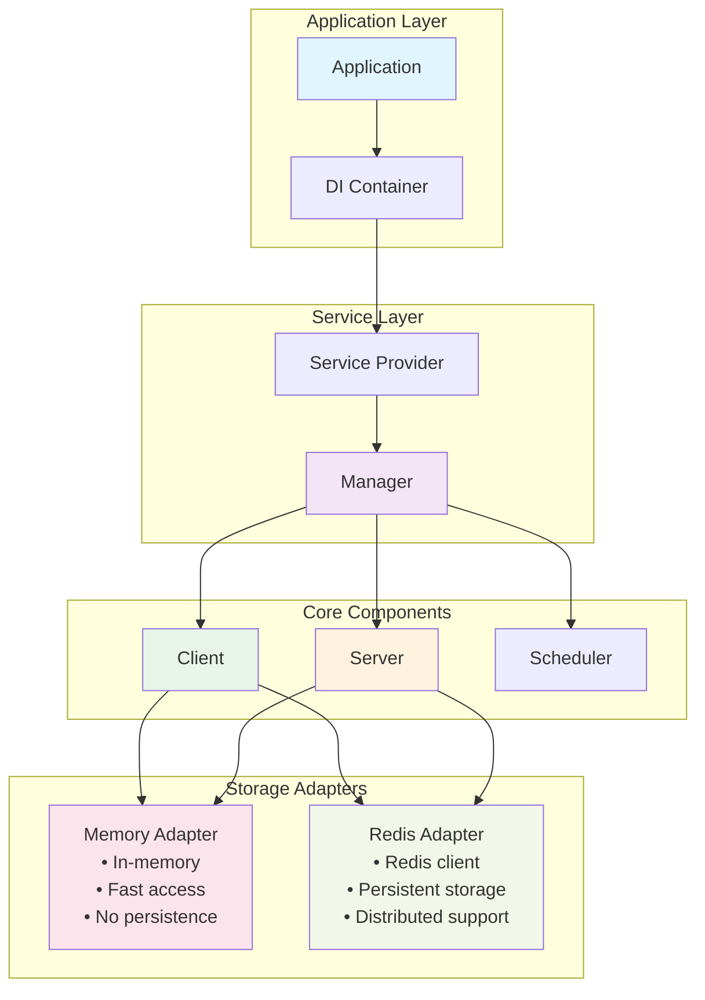
```mermaid
graph TB
    subgraph "Application Layer"
        APP[Application]
        DI[DI Container]
        APP --> DI
    end
    
    subgraph "Service Layer"
        SP[Service Provider]
        MGR[Manager]
        SP --> MGR
    end
    
    subgraph "Core Components"
        CLIENT[Client]
        SERVER[Server]
        SCHEDULER[Scheduler]
        MGR --> CLIENT
        MGR --> SERVER
        MGR --> SCHEDULER
    end
    
    subgraph "Storage Adapters"
        MEMORY[Memory Adapter<br/>• In-memory<br/>• Fast access<br/>• No persistence]
        REDIS[Redis Adapter<br/>• Redis client<br/>• Persistent storage<br/>• Distributed support]
    end
    
    DI --> SP
    CLIENT --> MEMORY
    CLIENT --> REDIS
    SERVER --> MEMORY
    SERVER --> REDIS
    
    style APP fill:#e1f5fe
    style MGR fill:#f3e5f5
    style CLIENT fill:#e8f5e8
    style SERVER fill:#fff3e0
    style MEMORY fill:#fce4ec
    style REDIS fill:#f1f8e9
```

## Các thành phần chính

### 1. Service Provider

**Vị trí**: [`provider.go`](../provider.go)

Service Provider là điểm khởi đầu của hệ thống, triển khai interface `di.ServiceProvider`:

```go
type ServiceProvider interface {
    di.ServiceProvider
    
    setupQueueScheduledTasks(schedulerManager scheduler.Manager, container di.Container)
    cleanupFailedJobs(manager Manager, container di.Container)
    retryFailedJobs(manager Manager, container di.Container)
}
```

**Chức năng chính**:
- Đăng ký các service vào DI container
- Khởi tạo và cấu hình các thành phần
- Thiết lập các tác vụ lên lịch
- Quản lý lifecycle của các service

### 2. Manager

**Vị trí**: [`manager.go`](../manager.go)

Manager là thành phần trung tâm quản lý tất cả các service khác:

```go
type Manager interface {
    RedisClient() redisClient.UniversalClient
    MemoryAdapter() adapter.QueueAdapter
    RedisAdapter() adapter.QueueAdapter
    Adapter(name string) adapter.QueueAdapter
    Client() Client
    Server() Server
    Scheduler() scheduler.Manager
    SetScheduler(scheduler scheduler.Manager)
}
```

**Chức năng chính**:
- Factory pattern cho tất cả các thành phần
- Quản lý cấu hình toàn cục
- Lazy loading các service
- Chia sẻ resources giữa các thành phần

### 3. Client

**Vị trí**: [`client.go`](../client.go)

Client cung cấp API để gửi tác vụ vào hàng đợi:

```go
type Client interface {
    Enqueue(taskName string, payload interface{}, opts ...Option) (*TaskInfo, error)
    EnqueueContext(ctx context.Context, taskName string, payload interface{}, opts ...Option) (*TaskInfo, error)
    EnqueueIn(taskName string, delay time.Duration, payload interface{}, opts ...Option) (*TaskInfo, error)
    EnqueueAt(taskName string, processAt time.Time, payload interface{}, opts ...Option) (*TaskInfo, error)
    Close() error
}
```

**Chức năng chính**:
- Enqueue tác vụ ngay lập tức
- Enqueue tác vụ với delay hoặc schedule
- Tích hợp với context cho cancellation
- Quản lý options và metadata

### 4. Server

**Vị trí**: [`server.go`](../server.go)

Server xử lý các tác vụ từ hàng đợi:

```go
type Server interface {
    RegisterHandler(taskName string, handler HandlerFunc)
    Start() error
    Stop() error
    IsRunning() bool
    GetScheduler() scheduler.Manager
    SetScheduler(scheduler scheduler.Manager)
}
```

**Chức năng chính**:
- Worker pool management
- Handler registration và routing
- Graceful shutdown
- Integration với scheduler cho delayed tasks

### 5. Adapters

**Vị trí**: [`adapter/`](../adapter/)

Adapters cung cấp lớp trừu tượng cho các backend storage khác nhau:

```go
type QueueAdapter interface {
    Enqueue(ctx context.Context, queueName string, task *Task) error
    Dequeue(ctx context.Context, queueName string) (*Task, error)
    DequeueWithTimeout(ctx context.Context, queueName string, timeout time.Duration) (*Task, error)
    EnqueueBatch(ctx context.Context, queueName string, tasks []*Task) error
    Size(ctx context.Context, queueName string) (int64, error)
    IsEmpty(ctx context.Context, queueName string) (bool, error)
    Clear(ctx context.Context, queueName string) error
}
```

#### Memory Adapter
- **Ưu điểm**: Tốc độ cao, không cần external dependencies
- **Nhược điểm**: Không persistent, chỉ phù hợp cho development hoặc testing
- **Sử dụng**: In-memory map với mutex cho thread safety

#### Redis Adapter  
- **Ưu điểm**: Persistent, distributed, scalable
- **Nhược điểm**: Cần Redis server, network latency
- **Sử dụng**: Redis lists và sorted sets

## Flow xử lý tác vụ

### 1. Enqueue Flow - Luồng đẩy tác vụ vào hàng đợi

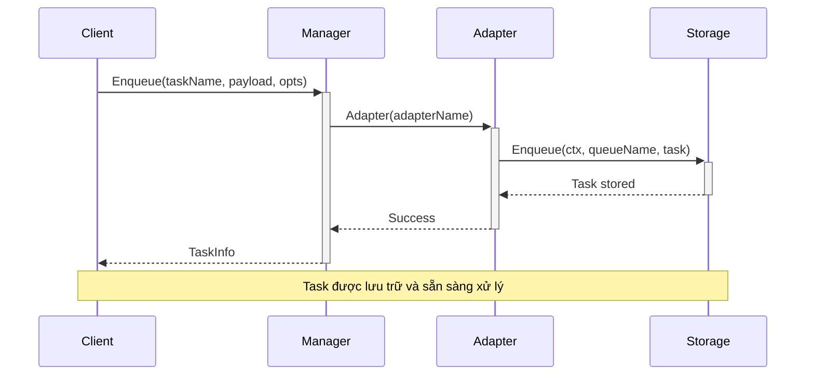
```mermaid
sequenceDiagram
    participant C as Client
    participant M as Manager
    participant A as Adapter
    participant S as Storage
    
    C->>+M: Enqueue(taskName, payload, opts)
    M->>+A: Adapter(adapterName)
    A->>+S: Enqueue(ctx, queueName, task)
    S-->>-A: Task stored
    A-->>-M: Success
    M-->>-C: TaskInfo
    
    Note over C,S: Task được lưu trữ và sẵn sàng xử lý
```

**Mô tả chi tiết:**

1. **Client gọi Enqueue**: Ứng dụng sử dụng Client để đẩy một tác vụ mới vào hàng đợi. Client nhận vào tên tác vụ, dữ liệu payload và các tùy chọn như queue name, retry count, delay time.

2. **Manager chọn Adapter**: Manager đóng vai trò factory pattern, xác định adapter nào sẽ được sử dụng (Memory hoặc Redis) dựa trên cấu hình hoặc tên được chỉ định trong options.

3. **Adapter xử lý lưu trữ**: Adapter nhận task và chuyển đổi nó thành format phù hợp với storage backend:
   - **Memory Adapter**: Lưu vào in-memory map với thread-safe mutex
   - **Redis Adapter**: Sử dụng Redis LIST hoặc SORTED SET để lưu trữ persistent

4. **Phản hồi thành công**: Khi task được lưu trữ thành công, hệ thống trả về TaskInfo chứa metadata như ID, queue name, thời gian tạo, và thời gian dự kiến xử lý.

**Ưu điểm của thiết kế:**
- **Tách biệt**: Client không cần biết chi tiết về storage backend
- **Linh hoạt**: Có thể chuyển đổi giữa Memory và Redis mà không thay đổi code
- **Extensible**: Dễ dàng thêm adapter mới (PostgreSQL, MongoDB, etc.)

### 2. Processing Flow - Luồng xử lý tác vụ

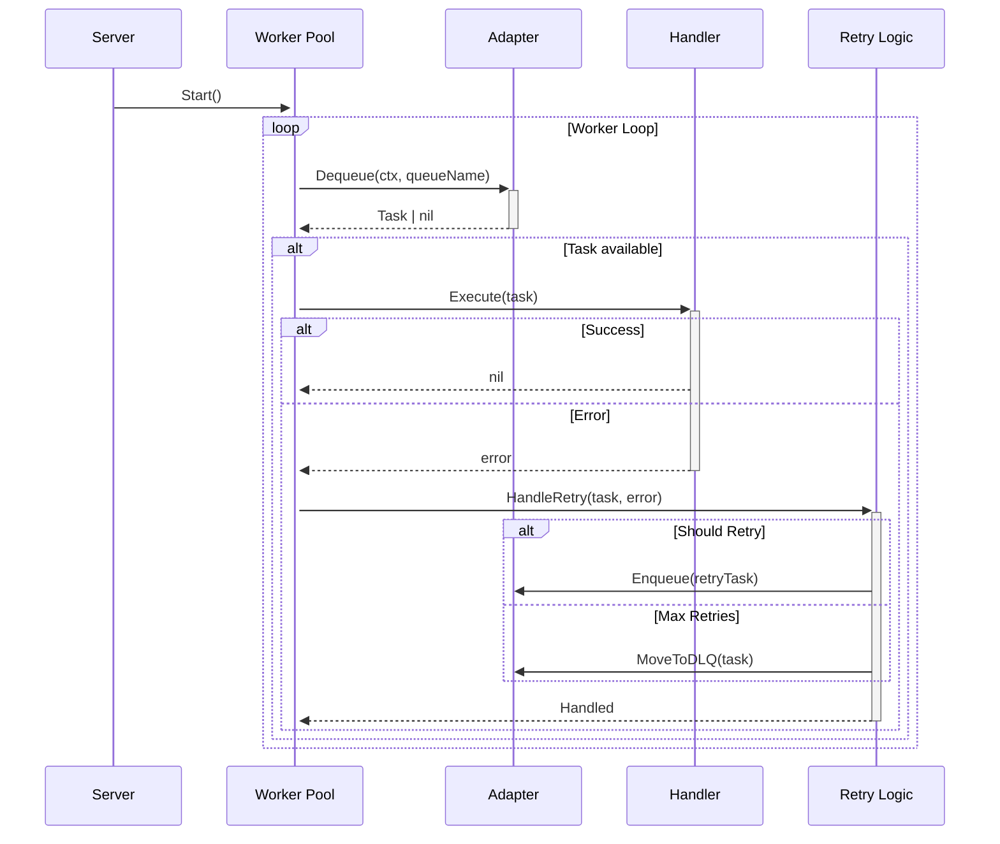
```mermaid
sequenceDiagram
    participant S as Server
    participant WP as Worker Pool
    participant A as Adapter
    participant H as Handler
    participant RL as Retry Logic
    
    S->>+WP: Start()
    loop Worker Loop
        WP->>+A: Dequeue(ctx, queueName)
        A-->>-WP: Task | nil
        alt Task available
            WP->>+H: Execute(task)
            alt Success
                H-->>WP: nil
            else Error
                H-->>-WP: error
                WP->>+RL: HandleRetry(task, error)
                alt Should Retry
                    RL->>A: Enqueue(retryTask)
                else Max Retries
                    RL->>A: MoveToDLQ(task)
                end
                RL-->>-WP: Handled
            end
        end
    end
```

**Mô tả chi tiết:**

1. **Server khởi động Worker Pool**: Khi Server.Start() được gọi, hệ thống tạo ra một pool các worker goroutines. Số lượng worker được cấu hình trong config file (thường là 10-50 workers tùy thuộc vào tài nguyên server).

2. **Worker Loop - Vòng lặp liên tục**: Mỗi worker chạy trong một goroutine riêng biệt và liên tục thực hiện các bước:
   - **Dequeue**: Gọi adapter để lấy task từ hàng đợi
   - **Blocking wait**: Nếu không có task, worker sẽ chờ (với timeout) hoặc sleep một khoảng thời gian ngắn

3. **Task Processing - Xử lý tác vụ**: Khi có task:
   - **Handler Lookup**: Server tìm handler đã được đăng ký cho loại task này
   - **Execution**: Handler được gọi với task data đã được unmarshal
   - **Context**: Task được xử lý với context để hỗ trợ timeout và cancellation

4. **Error Handling & Retry Logic**: Khi có lỗi xảy ra:
   - **Error Classification**: Phân loại lỗi (transient, permanent, configuration)
   - **Retry Decision**: Kiểm tra retry count với max retry limit
   - **Backoff Strategy**: Áp dụng delay (linear, exponential, hoặc custom)
   - **Re-enqueue**: Đưa task trở lại hàng đợi với retry count tăng
   - **Dead Letter Queue**: Task vượt quá max retry sẽ được chuyển vào DLQ

5. **Success Path**: Task thành công sẽ được xóa khỏi hàng đợi và worker tiếp tục với task tiếp theo.

**Đặc điểm kỹ thuật:**
- **Concurrent Processing**: Nhiều worker xử lý song song
- **Graceful Shutdown**: Server có thể dừng an toàn mà không làm mất task
- **Memory Management**: Giới hạn số lượng task trong memory để tránh OOM
- **Monitoring**: Metrics và logging cho mỗi bước xử lý

### 3. Scheduled Task Flow - Luồng lên lịch tác vụ

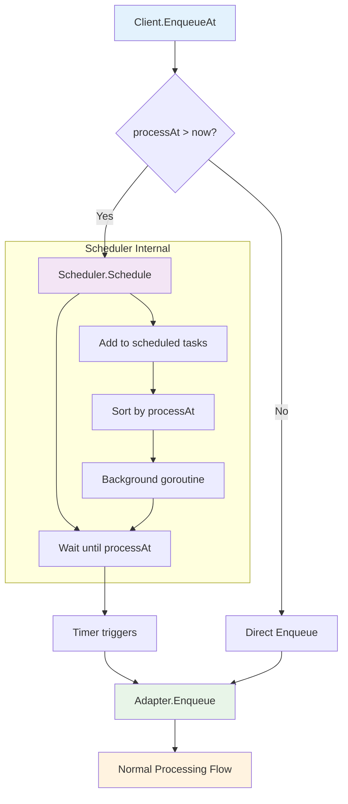
```mermaid
flowchart TD
    A[Client.EnqueueAt] --> B{processAt > now?}
    B -->|Yes| C[Scheduler.Schedule]
    B -->|No| D[Direct Enqueue]
    
    C --> E[Wait until processAt]
    E --> F[Timer triggers]
    F --> G[Adapter.Enqueue]
    
    D --> G
    G --> H[Normal Processing Flow]
    
    subgraph "Scheduler Internal"
        C --> I[Add to scheduled tasks]
        I --> J[Sort by processAt]
        J --> K[Background goroutine]
        K --> E
    end
    
    style A fill:#e3f2fd
    style C fill:#f3e5f5
    style G fill:#e8f5e8
    style H fill:#fff3e0
```

**Mô tả chi tiết:**

1. **Lên lịch Task**: Khi Client.EnqueueAt() hoặc Client.EnqueueIn() được gọi, hệ thống kiểm tra thời gian xử lý:
   - **Immediate**: Nếu processAt <= now, task được đưa thẳng vào hàng đợi
   - **Scheduled**: Nếu processAt > now, task được chuyển cho Scheduler

2. **Scheduler Internal Management**:
   - **Add to Schedule**: Task được thêm vào danh sách scheduled tasks
   - **Sorting**: Danh sách được sắp xếp theo thời gian processAt (priority queue)
   - **Memory Storage**: Scheduled tasks được lưu trong memory với backup vào Redis (nếu có)

3. **Background Processing**:
   - **Timer Goroutine**: Một goroutine chạy nền liên tục kiểm tra scheduled tasks
   - **Check Interval**: Mỗi 1-5 giây (có thể cấu hình) kiểm tra task nào đến hạn
   - **Batch Processing**: Xử lý nhiều task cùng lúc nếu có nhiều task đến hạn

4. **Task Activation**:
   - **Timer Trigger**: Khi đến thời gian processAt, timer trigger
   - **Move to Queue**: Task được chuyển từ scheduler vào hàng đợi chính
   - **Normal Flow**: Task tiếp tục qua normal processing flow

**Ưu điểm của Scheduler:**
- **Precision**: Chính xác đến giây (có thể cấu hình đến millisecond)
- **Scalable**: Hỗ trợ hàng ngàn scheduled tasks
- **Persistent**: Backup vào Redis để không mất task khi restart
- **Memory Efficient**: Chỉ load scheduled tasks gần đây vào memory

**Use Cases phổ biến:**
- **Cron Jobs**: Lên lịch hàng ngày/tuần/tháng
- **Reminders**: Gửi email nhắc nhở sau X ngày
- **Delayed Processing**: Xử lý sau khi user confirm
- **Rate Limiting**: Trì hoãn task để tránh spam API

## Design Patterns sử dụng

### Pattern Overview

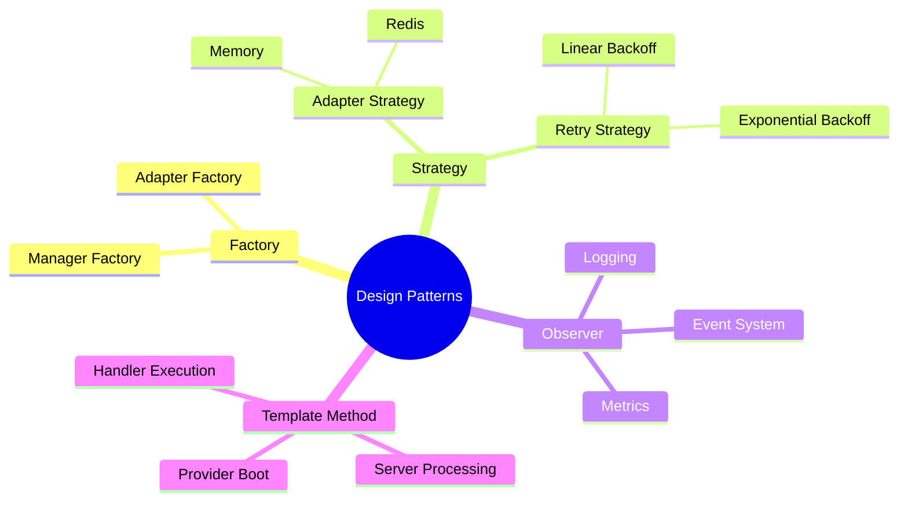
```mermaid
mindmap
  root((Design Patterns))
    Factory
      Manager Factory
      Adapter Factory
    Strategy
      Adapter Strategy
        Memory
        Redis
      Retry Strategy
        Linear Backoff
        Exponential Backoff
    Observer
      Event System
      Logging
      Metrics
    Template Method
      Server Processing
      Provider Boot
      Handler Execution
```

### 1. Factory Pattern

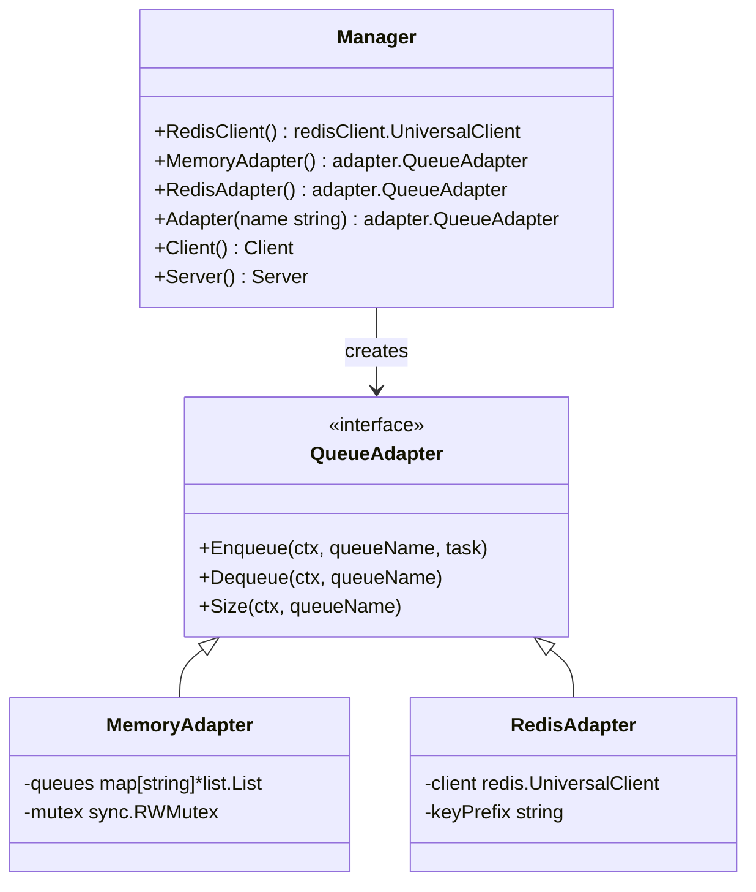
```mermaid
classDiagram
    class Manager {
        +RedisClient() redisClient.UniversalClient
        +MemoryAdapter() adapter.QueueAdapter
        +RedisAdapter() adapter.QueueAdapter
        +Adapter(name string) adapter.QueueAdapter
        +Client() Client
        +Server() Server
    }
    
    class QueueAdapter {
        <<interface>>
        +Enqueue(ctx, queueName, task)
        +Dequeue(ctx, queueName)
        +Size(ctx, queueName)
    }
    
    class MemoryAdapter {
        -queues map[string]*list.List
        -mutex sync.RWMutex
    }
    
    class RedisAdapter {
        -client redis.UniversalClient
        -keyPrefix string
    }
    
    Manager --> QueueAdapter : creates
    QueueAdapter <|-- MemoryAdapter
    QueueAdapter <|-- RedisAdapter
```

### 2. Strategy Pattern - Adapter Selection

```mermaid
flowchart TD
    A[Manager.Adapter(name)] --> B{Check Config}
    B -->|name == "memory"| C[Return MemoryAdapter]
    B -->|name == "redis"| D[Return RedisAdapter]
    B -->|name == "default"| E{Default Adapter?}
    E -->|Config.DefaultAdapter| F[Use Configured Default]
    E -->|Not Set| G[Use Memory as Default]
    
    C --> H[In-Memory Operations]
    D --> I[Redis Operations]
    F --> J[Configured Adapter Operations]
    G --> H
    
    style A fill:#e1f5fe
    style H fill:#fce4ec
    style I fill:#f1f8e9
```

**Mô tả Strategy Pattern:**

1. **Runtime Adapter Selection**: Manager.Adapter() method cho phép chọn adapter động tại runtime:
   - **Explicit Selection**: Chỉ định rõ adapter name ("memory", "redis")
   - **Default Fallback**: Sử dụng default adapter từ config
   - **Auto Fallback**: Memory adapter làm fallback cuối cùng

2. **Configuration-Driven**: Strategy được điều khiển bởi config:
   ```yaml
   queue:
     default_adapter: "redis"  # Strategy mặc định
     adapters:
       memory:
         enabled: true
       redis:
         enabled: true
         host: "localhost:6379"
   ```

3. **Transparent Switching**: Application code không thay đổi khi switch adapter:
   - Cùng interface QueueAdapter
   - Cùng method signatures
   - Behavior khác nhau (persistent vs in-memory)

4. **Use Case Scenarios**:
   - **Development**: Sử dụng Memory adapter cho tốc độ
   - **Production**: Sử dụng Redis adapter cho persistence
   - **Testing**: Memory adapter để isolation
   - **Hybrid**: Một số queue dùng Memory, queue khác dùng Redis

### 3. Observer Pattern - Event System

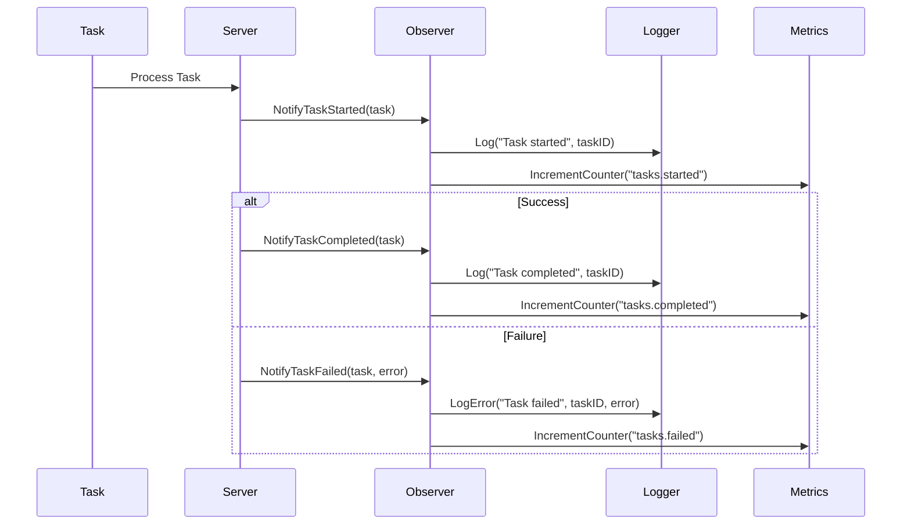
```mermaid
sequenceDiagram
    participant T as Task
    participant S as Server
    participant O as Observer
    participant L as Logger
    participant M as Metrics
    
    T->>S: Process Task
    S->>O: NotifyTaskStarted(task)
    O->>L: Log("Task started", taskID)
    O->>M: IncrementCounter("tasks.started")
    
    alt Success
        S->>O: NotifyTaskCompleted(task)
        O->>L: Log("Task completed", taskID)
        O->>M: IncrementCounter("tasks.completed")
    else Failure
        S->>O: NotifyTaskFailed(task, error)
        O->>L: LogError("Task failed", taskID, error)
        O->>M: IncrementCounter("tasks.failed")
    end
```

**Mô tả Observer Pattern:**

1. **Event-Driven Architecture**: Server phát ra events tại các điểm quan trọng trong lifecycle của task:
   - **TaskStarted**: Khi task bắt đầu được xử lý
   - **TaskCompleted**: Khi task hoàn thành thành công
   - **TaskFailed**: Khi task gặp lỗi
   - **TaskRetried**: Khi task được thử lại
   - **TaskDeadLettered**: Khi task được chuyển vào DLQ

2. **Multiple Observers**: Hệ thống hỗ trợ nhiều observer cùng lúc:
   - **Logger Observer**: Ghi log structured với context
   - **Metrics Observer**: Thu thập metrics cho monitoring
   - **Alerting Observer**: Gửi alert khi có vấn đề
   - **Audit Observer**: Ghi audit trail cho compliance

3. **Decoupled Design**: Server không cần biết chi tiết về observers:
   - Interface-based communication
   - Async processing để không block task processing
   - Error isolation (lỗi ở observer không ảnh hưởng task)

4. **Extensibility**: Dễ dàng thêm observer mới:
   - Webhook observer để call external APIs
   - Database observer để lưu task history
   - Email observer để thông báo admin

### 4. Template Method Pattern - Task Processing

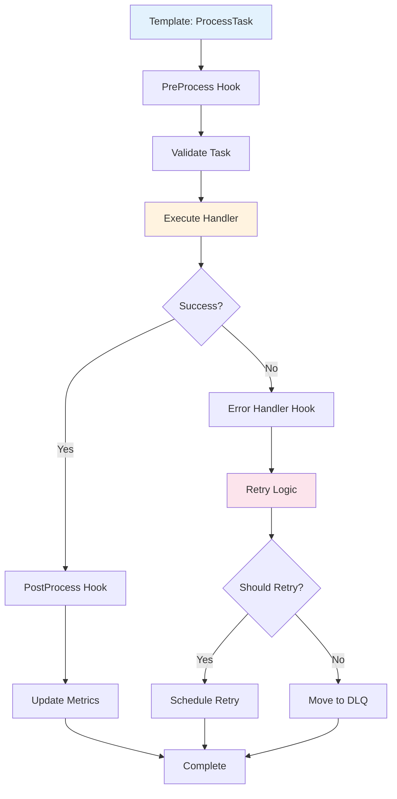
```mermaid
flowchart TD
    A[Template: ProcessTask] --> B[PreProcess Hook]
    B --> C[Validate Task]
    C --> D[Execute Handler]
    D --> E{Success?}
    E -->|Yes| F[PostProcess Hook]
    E -->|No| G[Error Handler Hook]
    F --> H[Update Metrics]
    G --> I[Retry Logic]
    I --> J{Should Retry?}
    J -->|Yes| K[Schedule Retry]
    J -->|No| L[Move to DLQ]
    H --> M[Complete]
    K --> M
    L --> M
    
    style A fill:#e3f2fd
    style D fill:#fff3e0
    style I fill:#fce4ec
```

**Mô tả Template Method Pattern:**

1. **Template Structure**: Server định nghĩa template cố định cho việc xử lý task:
   - **PreProcess Hook**: Preparation steps (metrics, logging, validation)
   - **Core Processing**: Execute business logic handler
   - **PostProcess Hook**: Cleanup, metrics update, notifications
   - **Error Handling**: Standardized error recovery

2. **Hook Points**: Các điểm extension cho customization:
   ```go
   type ProcessingHooks struct {
       BeforeProcess func(task *Task) error
       AfterProcess  func(task *Task, result interface{}) error
       OnError       func(task *Task, err error) error
   }
   ```

3. **Consistent Behavior**: Đảm bảo mọi task đều được xử lý theo cùng một pattern:
   - Timeout handling
   - Context cancellation
   - Resource cleanup
   - Error reporting

4. **Extensible Processing**: Cho phép custom logic mà không thay đổi core workflow:
   - Authentication hooks
   - Authorization checks
   - Input validation
   - Output transformation
   - Audit logging

**Lợi ích:**
- **Consistency**: Mọi task đều follow cùng workflow
- **Maintainability**: Dễ debug và troubleshoot
- **Extensibility**: Thêm functionality mà không break existing code
- **Testing**: Dễ mock và test từng component

## Dependency Injection

### DI Container Flow

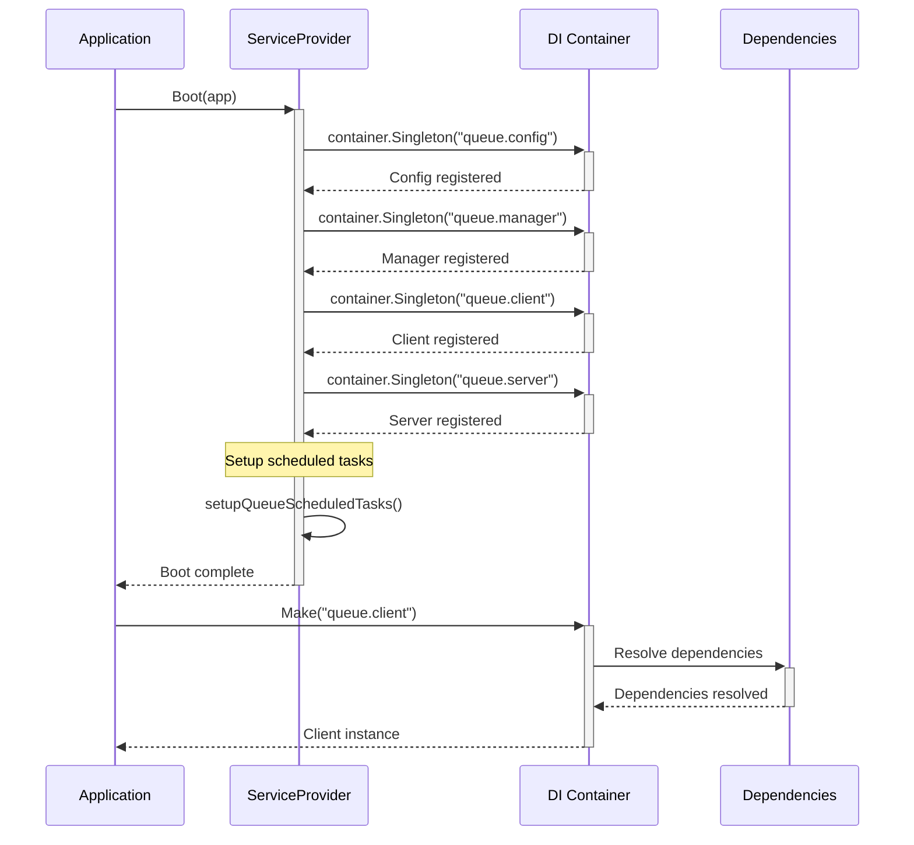
```mermaid
sequenceDiagram
    participant App as Application
    participant SP as ServiceProvider
    participant DI as DI Container
    participant Deps as Dependencies
    
    App->>+SP: Boot(app)
    SP->>+DI: container.Singleton("queue.config")
    DI-->>-SP: Config registered
    
    SP->>+DI: container.Singleton("queue.manager")
    DI-->>-SP: Manager registered
    
    SP->>+DI: container.Singleton("queue.client")
    DI-->>-SP: Client registered
    
    SP->>+DI: container.Singleton("queue.server")
    DI-->>-SP: Server registered
    
    Note over SP: Setup scheduled tasks
    SP->>SP: setupQueueScheduledTasks()
    SP-->>-App: Boot complete
    
    App->>+DI: Make("queue.client")
    DI->>+Deps: Resolve dependencies
    Deps-->>-DI: Dependencies resolved
    DI-->>-App: Client instance
```

**Mô tả DI Container Flow:**

1. **Application Bootstrap**: Application khởi động và gọi ServiceProvider.Boot():
   - Load configuration từ files hoặc environment variables
   - Initialize DI container với base services
   - Register all queue-related services

2. **Service Registration Phase**:
   - **Singleton Pattern**: Mỗi service chỉ được tạo một instance duy nhất
   - **Lazy Loading**: Service chỉ được khởi tạo khi được request lần đầu
   - **Dependency Declaration**: Khai báo dependencies giữa các services

3. **Dependency Resolution**:
   ```go
   // Config được resolve trước
   config, _ := container.Make("queue.config")
   
   // Manager depends on config
   manager := NewManagerWithContainer(config, container)
   
   // Client depends on manager
   client := manager.Client()
   ```

4. **Scheduled Tasks Setup**: Sau khi services được đăng ký:
   - Setup cleanup tasks cho failed jobs
   - Setup retry tasks cho failed jobs
   - Register cron jobs với scheduler

5. **Runtime Resolution**: Khi application cần sử dụng service:
   - DI container resolve dependencies recursively
   - Cache instances để tránh tạo lại
   - Return ready-to-use service instance

**Lợi ích của DI:**
- **Testability**: Dễ mock dependencies cho unit tests
- **Flexibility**: Có thể swap implementations
- **Lifecycle Management**: Container quản lý lifecycle
- **Configuration**: Centralized configuration management

### Service Dependencies Graph

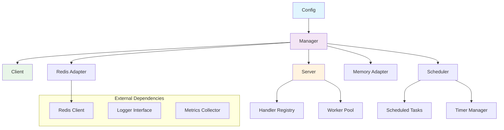
```mermaid
graph TD
    Config[Config] --> Manager[Manager]
    Manager --> Client[Client]
    Manager --> Server[Server]
    Manager --> Scheduler[Scheduler]
    
    Manager --> MemoryAdapter[Memory Adapter]
    Manager --> RedisAdapter[Redis Adapter]
    
    RedisAdapter --> RedisClient[Redis Client]
    
    Server --> HandlerRegistry[Handler Registry]
    Server --> WorkerPool[Worker Pool]
    
    Scheduler --> ScheduledTasks[Scheduled Tasks]
    Scheduler --> TimerManager[Timer Manager]
    
    subgraph "External Dependencies"
        RedisClient
        LoggerInterface[Logger Interface]
        MetricsCollector[Metrics Collector]
    end
    
    style Config fill:#e1f5fe
    style Manager fill:#f3e5f5
    style Client fill:#e8f5e8
    style Server fill:#fff3e0
```

## Thread Safety

### Concurrency Model

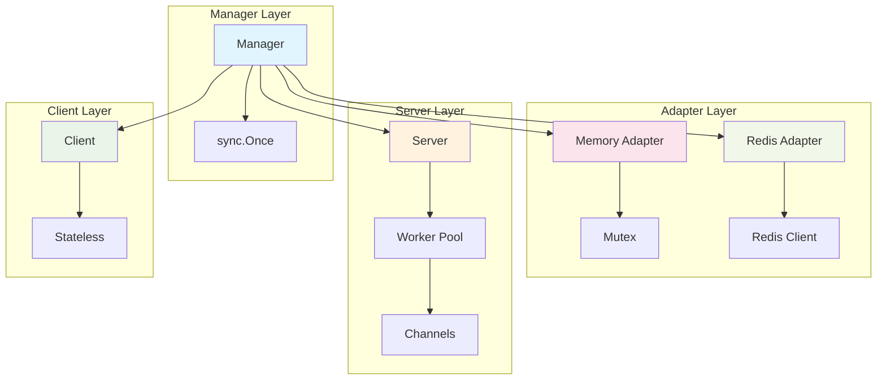
```mermaid
graph TD
    subgraph "Manager Layer"
        M[Manager]
        SO[sync.Once]
        M --> SO
    end
    
    subgraph "Adapter Layer"
        MA[Memory Adapter]
        MU[Mutex]
        MA --> MU
        
        RA[Redis Adapter]
        RC[Redis Client]
        RA --> RC
    end
    
    subgraph "Server Layer"
        S[Server]
        WP[Worker Pool]
        CH[Channels]
        S --> WP
        WP --> CH
    end
    
    subgraph "Client Layer"
        C[Client]
        ST[Stateless]
        C --> ST
    end
    
    M --> MA
    M --> RA
    M --> S
    M --> C
    
    style M fill:#e1f5fe
    style MA fill:#fce4ec
    style RA fill:#f1f8e9
    style S fill:#fff3e0
    style C fill:#e8f5e8
```

### Worker Pool Architecture

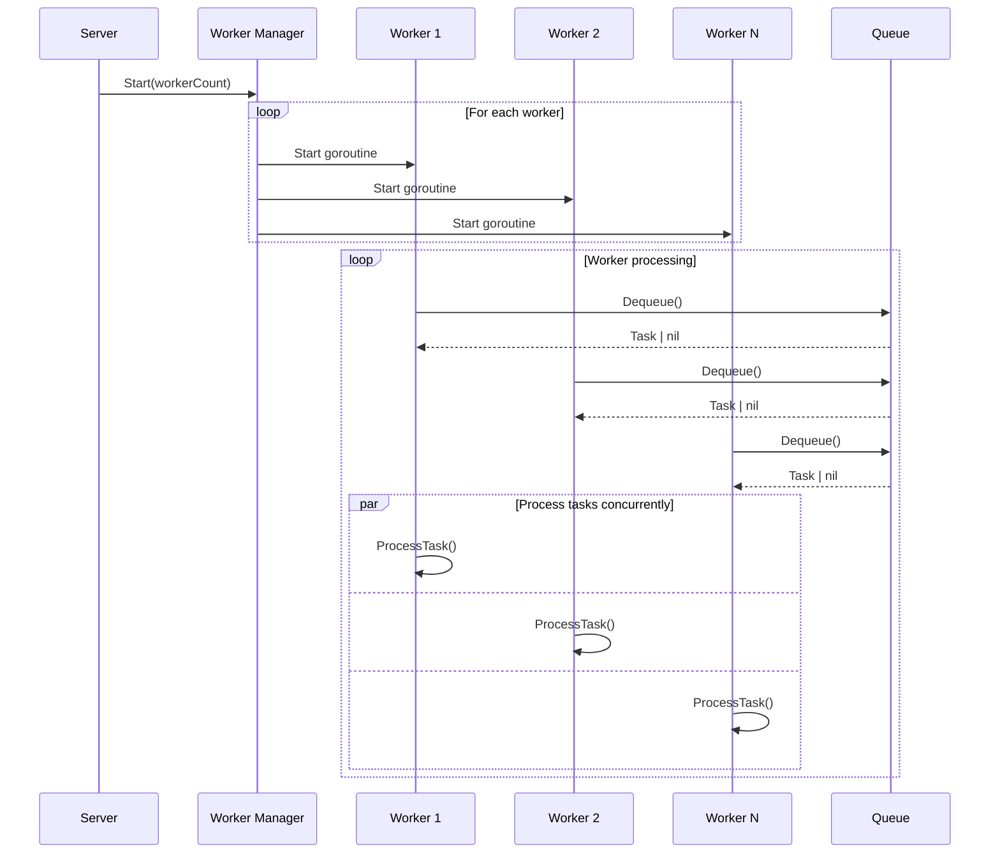
```mermaid
sequenceDiagram
    participant S as Server
    participant WM as Worker Manager
    participant W1 as Worker 1
    participant W2 as Worker 2
    participant WN as Worker N
    participant Q as Queue
    
    S->>WM: Start(workerCount)
    
    loop For each worker
        WM->>W1: Start goroutine
        WM->>W2: Start goroutine
        WM->>WN: Start goroutine
    end
    
    loop Worker processing
        W1->>Q: Dequeue()
        Q-->>W1: Task | nil
        W2->>Q: Dequeue()
        Q-->>W2: Task | nil
        WN->>Q: Dequeue()
        Q-->>WN: Task | nil
        
        par Process tasks concurrently
            W1->>W1: ProcessTask()
        and
            W2->>W2: ProcessTask()
        and
            WN->>WN: ProcessTask()
        end
    end
```

**Mô tả Worker Pool Architecture:**

1. **Worker Pool Initialization**:
   - **Dynamic Sizing**: Số worker được cấu hình trong config (default: 10)
   - **Goroutine Per Worker**: Mỗi worker chạy trong một goroutine riêng biệt
   - **Shared Resources**: Workers chia sẻ adapter và handler registry

2. **Load Balancing Strategy**:
   - **Pull Model**: Workers chủ động pull tasks từ queue (không phải push)
   - **Fair Distribution**: Ai rảnh thì lấy task tiếp theo (natural load balancing)
   - **No Central Dispatcher**: Không có component trung tâm phân phối task

3. **Concurrency Control**:
   ```go
   // Worker goroutine pattern
   func (w *worker) Start() {
       for {
           task, err := w.adapter.Dequeue(w.ctx, w.queueName)
           if err != nil || task == nil {
               time.Sleep(pollInterval)
               continue
           }
           
           w.processTask(task)
       }
   }
   ```

4. **Graceful Shutdown**:
   - **Context Cancellation**: Sử dụng context để signal shutdown
   - **In-Flight Tasks**: Cho phép tasks đang chạy hoàn thành
   - **Timeout**: Force shutdown sau timeout period
   - **Resource Cleanup**: Đóng connections và cleanup resources

5. **Error Handling**:
   - **Worker Isolation**: Lỗi ở một worker không ảnh hưởng workers khác
   - **Auto Recovery**: Worker tự động recover từ panic
   - **Circuit Breaker**: Tạm dừng worker nếu có quá nhiều lỗi liên tiếp

**Performance Benefits:**
- **High Throughput**: Xử lý song song nhiều tasks
- **Resource Efficiency**: Reuse goroutines thay vì tạo mới cho mỗi task
- **Scalability**: Dễ dàng tăng/giảm số workers based on load
- **Fault Tolerance**: System tiếp tục hoạt động khi một số workers fail

## Monitoring và Observability

### Metrics Flow

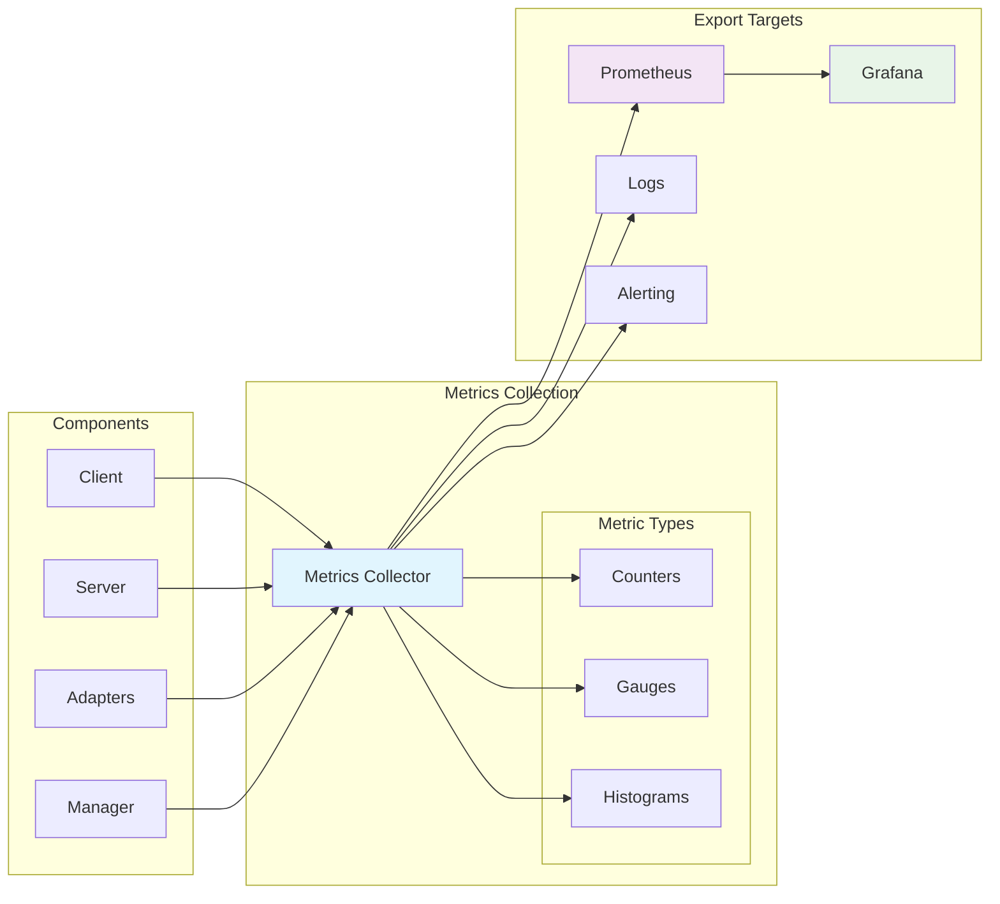
```mermaid
flowchart LR
    subgraph "Components"
        C[Client]
        S[Server]
        A[Adapters]
        M[Manager]
    end
    
    subgraph "Metrics Collection"
        MC[Metrics Collector]
        subgraph "Metric Types"
            CTR[Counters]
            GAU[Gauges]
            HIS[Histograms]
        end
        MC --> CTR
        MC --> GAU
        MC --> HIS
    end
    
    subgraph "Export Targets"
        PROM[Prometheus]
        GRAF[Grafana]
        LOG[Logs]
        ALERT[Alerting]
    end
    
    C --> MC
    S --> MC
    A --> MC
    M --> MC
    
    MC --> PROM
    PROM --> GRAF
    MC --> LOG
    MC --> ALERT
    
    style MC fill:#e1f5fe
    style PROM fill:#f3e5f5
    style GRAF fill:#e8f5e8
```

### Key Metrics Dashboard

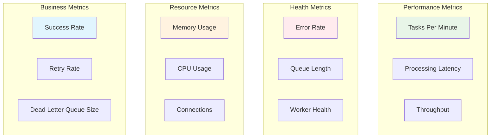
```mermaid
graph TB
    subgraph "Performance Metrics"
        TPM[Tasks Per Minute]
        LAT[Processing Latency]
        THR[Throughput]
    end
    
    subgraph "Health Metrics"
        ER[Error Rate]
        QL[Queue Length]
        WH[Worker Health]
    end
    
    subgraph "Resource Metrics"
        MEM[Memory Usage]
        CPU[CPU Usage]
        CON[Connections]
    end
    
    subgraph "Business Metrics"
        SR[Success Rate]
        RR[Retry Rate]
        DLQ[Dead Letter Queue Size]
    end
    
    style TPM fill:#e8f5e8
    style ER fill:#ffebee
    style MEM fill:#fff3e0
    style SR fill:#e1f5fe
```

### Logging Architecture

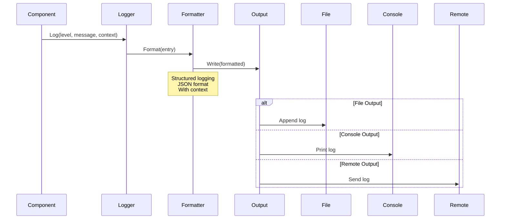
```mermaid
sequenceDiagram
    participant C as Component
    participant L as Logger
    participant F as Formatter
    participant O as Output
    
    C->>L: Log(level, message, context)
    L->>F: Format(entry)
    F->>O: Write(formatted)
    
    Note over F: Structured logging<br/>JSON format<br/>With context
    
    alt File Output
        O->>File: Append log
    else Console Output
        O->>Console: Print log
    else Remote Output
        O->>Remote: Send log
    end
```

### Health Check System

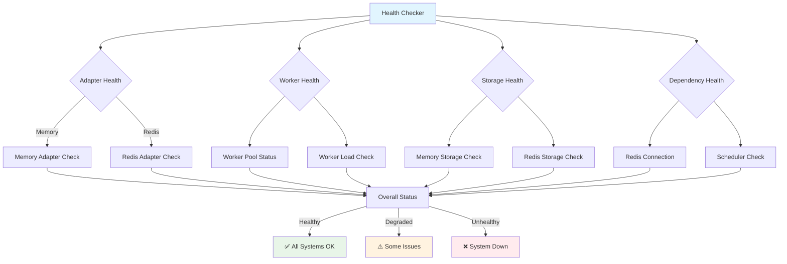
```mermaid
flowchart TD
    HC[Health Checker] --> AH{Adapter Health}
    HC --> WH{Worker Health}
    HC --> SH{Storage Health}
    HC --> DH{Dependency Health}
    
    AH -->|Memory| AMH[Memory Adapter Check]
    AH -->|Redis| ARH[Redis Adapter Check]
    
    WH --> WPH[Worker Pool Status]
    WH --> WLH[Worker Load Check]
    
    SH --> MSH[Memory Storage Check]
    SH --> RSH[Redis Storage Check]
    
    DH --> RCH[Redis Connection]
    DH --> SCH[Scheduler Check]
    
    AMH --> STATUS[Overall Status]
    ARH --> STATUS
    WPH --> STATUS
    WLH --> STATUS
    MSH --> STATUS
    RSH --> STATUS
    RCH --> STATUS
    SCH --> STATUS
    
    STATUS --> |Healthy| PASS[✅ All Systems OK]
    STATUS --> |Degraded| WARN[⚠️ Some Issues]
    STATUS --> |Unhealthy| FAIL[❌ System Down]
    
    style HC fill:#e1f5fe
    style PASS fill:#e8f5e8
    style WARN fill:#fff3e0
    style FAIL fill:#ffebee
```

**Mô tả Health Check System:**

1. **Multi-Layer Health Monitoring**:
   - **Component Level**: Kiểm tra từng component riêng biệt
   - **Integration Level**: Kiểm tra khả năng tương tác giữa components
   - **End-to-End**: Kiểm tra toàn bộ flow từ enqueue đến process

2. **Adapter Health Checks**:
   - **Memory Adapter**: Kiểm tra memory usage, queue sizes, mutex deadlocks
   - **Redis Adapter**: Test Redis connectivity, latency, available memory
   - **Performance**: Measure enqueue/dequeue response times

3. **Worker Pool Health**:
   - **Worker Status**: Số workers đang active/idle/error
   - **Task Throughput**: Tasks processed per minute
   - **Error Rate**: Percentage của tasks failed
   - **Queue Backlog**: Số tasks pending trong queue

4. **Storage Health**:
   - **Connection Status**: Database/Redis connection availability
   - **Resource Usage**: Memory, disk, CPU usage
   - **Capacity Limits**: Kiểm tra gần đạt limits

5. **Dependency Health**:
   - **External Services**: APIs, databases, file systems
   - **Network**: Connectivity, latency, bandwidth
   - **Scheduler**: Scheduled tasks functioning properly

6. **Health Status Levels**:
   ```go
   type HealthStatus int
   
   const (
       Healthy   HealthStatus = iota  // All systems operational
       Degraded                       // Some non-critical issues
       Unhealthy                      // Critical issues, may not work
   )
   ```

7. **Auto-Recovery Actions**:
   - **Degraded**: Log warnings, attempt auto-fix, reduce load
   - **Unhealthy**: Alert administrators, graceful shutdown if needed
   - **Circuit Breaker**: Temporarily disable failing components

**Monitoring Integration:**
- **Metrics Export**: Health status → Prometheus → Grafana dashboards
- **Alerting**: Webhook notifications khi status thay đổi
- **Logging**: Detailed health check results với context
- **API Endpoint**: HTTP endpoint để external monitoring tools check

## Best Practices

### Error Handling Strategy

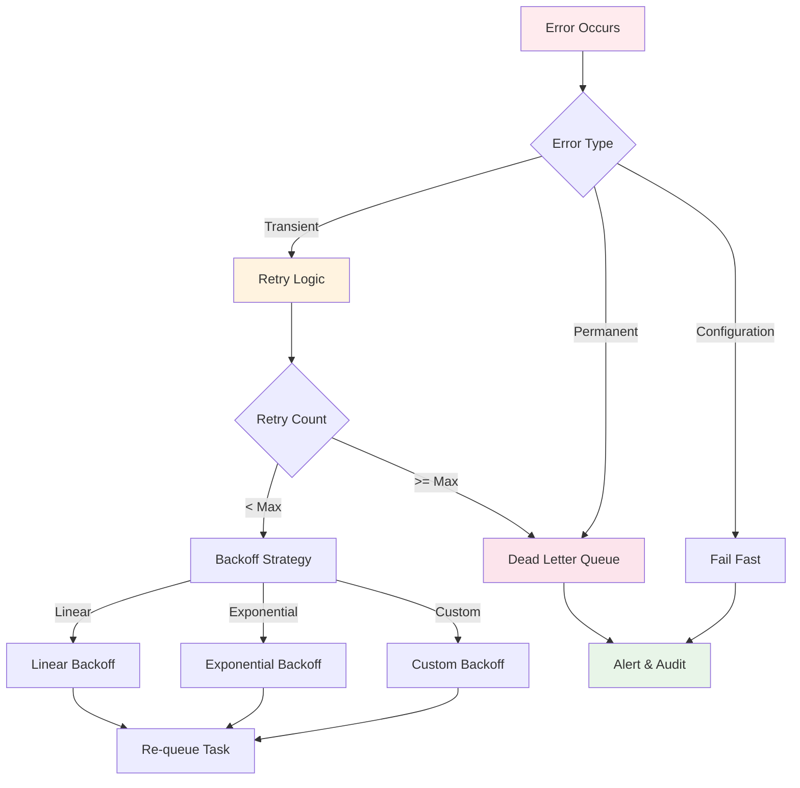
```mermaid
flowchart TD
    E[Error Occurs] --> T{Error Type}
    
    T -->|Transient| R[Retry Logic]
    T -->|Permanent| D[Dead Letter Queue]
    T -->|Configuration| F[Fail Fast]
    
    R --> C{Retry Count}
    C -->|< Max| B[Backoff Strategy]
    C -->|>= Max| D
    
    B --> |Linear| LB[Linear Backoff]
    B --> |Exponential| EB[Exponential Backoff]
    B --> |Custom| CB[Custom Backoff]
    
    LB --> RQ[Re-queue Task]
    EB --> RQ
    CB --> RQ
    
    D --> A[Alert & Audit]
    F --> A
    
    style E fill:#ffebee
    style R fill:#fff3e0
    style D fill:#fce4ec
    style A fill:#e8f5e8
```

**Mô tả Error Handling Strategy:**

1. **Error Classification**: Hệ thống phân loại lỗi thành 3 categories:
   - **Transient Errors**: Lỗi tạm thời (network timeout, temporary service unavailable)
   - **Permanent Errors**: Lỗi vĩnh viễn (invalid data, business logic violation)
   - **Configuration Errors**: Lỗi cấu hình (missing handler, invalid queue name)

2. **Retry Logic for Transient Errors**:
   ```go
   type RetryConfig struct {
       MaxRetries int           // Số lần retry tối đa
       Strategy   string        // "linear", "exponential", "custom"
       BaseDelay  time.Duration // Delay cơ bản
       MaxDelay   time.Duration // Delay tối đa
   }
   ```

3. **Backoff Strategies**:
   - **Linear Backoff**: delay = baseDelay * retryCount (1s, 2s, 3s, 4s...)
   - **Exponential Backoff**: delay = baseDelay * 2^retryCount (1s, 2s, 4s, 8s...)
   - **Custom Backoff**: Định nghĩa delay sequence riêng (1s, 5s, 30s, 300s...)

4. **Dead Letter Queue (DLQ)**:
   - **Purpose**: Lưu trữ tasks không thể xử lý được sau max retries
   - **Analysis**: Admin có thể analyze failed tasks để fix issues
   - **Reprocessing**: Có thể move tasks từ DLQ về main queue sau khi fix
   - **Alerting**: Automatic alerts khi DLQ size vượt threshold

5. **Fail Fast Strategy**:
   - **Configuration Errors**: Không retry, fail immediately
   - **Invalid Data**: Validation errors không retry
   - **Resource Exhaustion**: Stop accepting new tasks temporarily

6. **Error Recovery Actions**:
   - **Logging**: Log errors với full context và stack trace
   - **Metrics**: Track error rates, retry counts, DLQ sizes
   - **Alerting**: Notify operations team về critical errors
   - **Circuit Breaker**: Temporarily disable failing components

**Best Practices:**
- **Idempotent Handlers**: Ensure handlers can be safely retried
- **Error Wrapping**: Preserve error context through retry cycles
- **Monitoring**: Track error patterns để identify systemic issues
- **Graceful Degradation**: Continue processing other tasks khi một số fail

### Resource Management

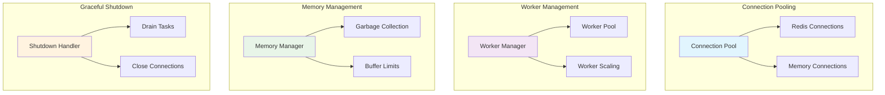
```mermaid
graph TD
    subgraph "Connection Pooling"
        CP[Connection Pool]
        RC[Redis Connections]
        MC[Memory Connections]
        CP --> RC
        CP --> MC
    end
    
    subgraph "Worker Management"
        WM[Worker Manager]
        WP[Worker Pool]
        WS[Worker Scaling]
        WM --> WP
        WM --> WS
    end
    
    subgraph "Memory Management"
        MM[Memory Manager]
        GC[Garbage Collection]
        BL[Buffer Limits]
        MM --> GC
        MM --> BL
    end
    
    subgraph "Graceful Shutdown"
        GS[Shutdown Handler]
        DT[Drain Tasks]
        CC[Close Connections]
        GS --> DT
        GS --> CC
    end
    
    style CP fill:#e1f5fe
    style WM fill:#f3e5f5
    style MM fill:#e8f5e8
    style GS fill:#fff3e0
```

### Configuration Best Practices

```go
// Trong provider.go - tham chiếu từ source code
func (p *serviceProvider) Boot(app di.Application) error {
    container := app.Container()
    
    // Đăng ký config với validation
    container.Singleton("queue.config", func() (Config, error) {
        config := loadConfig(container)
        if err := validateConfig(config); err != nil {
            return nil, fmt.Errorf("invalid queue config: %w", err)
        }
        return config, nil
    })
    
    // Đăng ký manager với error handling
    container.Singleton("queue.manager", func() (Manager, error) {
        config, err := container.Make("queue.config")
        if err != nil {
            return nil, fmt.Errorf("failed to resolve config: %w", err)
        }
        return NewManagerWithContainer(config.(Config), container), nil
    })
    
    // Setup scheduled tasks với recovery
    if err := p.setupQueueScheduledTasks(schedulerManager, container); err != nil {
        return fmt.Errorf("failed to setup scheduled tasks: %w", err)
    }
    
    return nil
}
```

### Performance Optimization

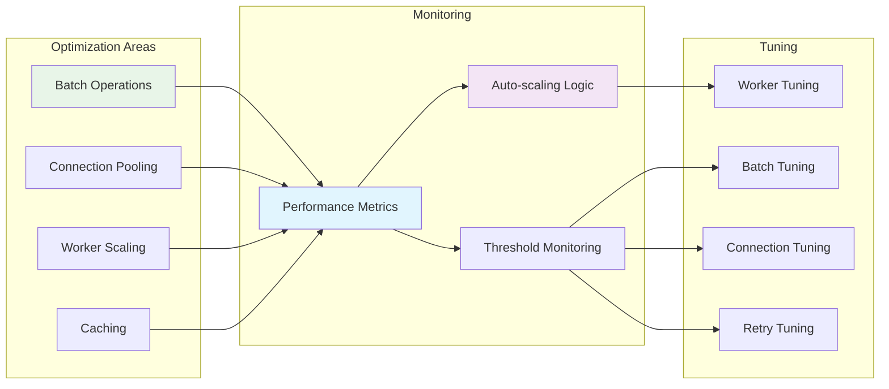
```mermaid
graph LR
    subgraph "Optimization Areas"
        BO[Batch Operations]
        CP[Connection Pooling]
        WS[Worker Scaling]
        CA[Caching]
    end
    
    subgraph "Monitoring"
        PM[Performance Metrics]
        AL[Auto-scaling Logic]
        TH[Threshold Monitoring]
    end
    
    subgraph "Tuning"
        BT[Batch Tuning]
        WT[Worker Tuning]
        CT[Connection Tuning]
        RT[Retry Tuning]
    end
    
    BO --> PM
    CP --> PM
    WS --> PM
    CA --> PM
    
    PM --> AL
    PM --> TH
    
    AL --> WT
    TH --> BT
    TH --> CT
    TH --> RT
    
    style BO fill:#e8f5e8
    style PM fill:#e1f5fe
    style AL fill:#f3e5f5
```

**Tham chiếu cấu hình**: [`configs/app.sample.yaml`](../configs/app.sample.yaml) dòng 1-128
