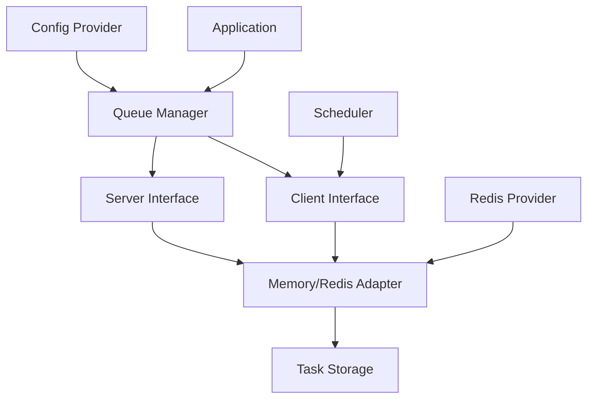

# Queue Package Documentation

## Tổng quan

Package `go.fork.vn/queue` cung cấp một hệ thống quản lý hàng đợi và xử lý tác vụ nền mạnh mẽ, linh hoạt cho ứng dụng Go, được thiết kế để tích hợp dễ dàng với hệ thống Dependency Injection `go.fork.vn/di`.

### Đặc điểm chính

- **Kiến trúc Module hóa**: Dễ bảo trì và mở rộng với thiết kế adapter pattern
- **Dual Adapter Support**: Hỗ trợ cả Redis và Memory adapter cho mọi môi trường
- **Redis Provider Integration**: Tích hợp hoàn chỉnh với Redis Provider để centralize Redis configuration
- **Advanced Redis Features**: Priority queues, TTL support, batch operations, monitoring
- **Scheduler Integration**: Tích hợp seamless với Scheduler Provider cho delayed/scheduled tasks
- **Advanced Task Management**: Retry logic, dead letter queue, task tracking
- **Configuration-driven**: Cấu hình hoàn toàn qua file config với validation
- **Worker Model**: Xử lý tác vụ đa luồng với concurrency control
- **Queue Priority**: Multiple queues với strict priority ordering
- **Batch Processing**: High-performance batch operations
- **Maintenance Tasks**: Tự động cleanup và retry failed jobs

## Kiến trúc

### Core Components

```
Queue Package
├── Manager              # Quản lý toàn bộ queue system
├── Client               # Interface cho enqueue operations
├── Server               # Worker system để process tasks
├── Task                 # Task definition và metadata
├── Adapters/
│   ├── Memory          # In-memory adapter cho development
│   └── Redis           # Redis adapter cho production
├── Configuration/
│   ├── AdapterConfig   # Cấu hình adapter
│   ├── ServerConfig    # Cấu hình worker server
│   └── ClientConfig    # Cấu hình client options
└── ServiceProvider     # DI integration
```

### Adapter Pattern

Queue package sử dụng adapter pattern để hỗ trợ multiple backends:

- **Memory Adapter**: Lưu trữ trong memory, phù hợp cho development và testing
- **Redis Adapter**: Distributed queue với Redis, production-ready với advanced features

### Integration Flow



## Interfaces và API

### Manager Interface

```go
type Manager interface {
    // Core queue operations
    Client() Client
    Server() Server
    
    // Adapter access
    RedisAdapter() QueueAdapter
    MemoryAdapter() QueueAdapter
    
    // Configuration and monitoring
    Config() *Config
    Stats() (*Stats, error)
    
    // Lifecycle management
    Start() error
    Stop() error
    IsRunning() bool
}
```

### Client Interface

```go
type Client interface {
    // Basic operations
    Enqueue(taskName string, payload interface{}, options ...EnqueueOption) (*TaskInfo, error)
    
    // Delayed operations
    EnqueueIn(taskName string, delay time.Duration, payload interface{}, options ...EnqueueOption) (*TaskInfo, error)
    EnqueueAt(taskName string, processAt time.Time, payload interface{}, options ...EnqueueOption) (*TaskInfo, error)
    
    // Task management
    Cancel(taskID string) error
    GetTask(taskID string) (*TaskInfo, error)
    
    // Batch operations
    EnqueueBatch(tasks []BatchTask, options ...EnqueueOption) ([]*TaskInfo, error)
}
```

### Server Interface

```go
type Server interface {
    // Handler registration
    RegisterHandler(taskName string, handler HandlerFunc) error
    RegisterHandlers(handlers map[string]HandlerFunc) error
    
    // Lifecycle
    Start() error
    Stop() error
    IsRunning() bool
    
    // Monitoring
    Workers() []*WorkerInfo
    Stats() (*ServerStats, error)
}
```

### QueueAdapter Interface

```go
type QueueAdapter interface {
    // Core operations
    Enqueue(ctx context.Context, queueName string, task *Task) error
    Dequeue(ctx context.Context, queueName string) (*Task, error)
    
    // Queue management
    Size(ctx context.Context, queueName string) (int64, error)
    Clear(ctx context.Context, queueName string) error
    
    // Health and monitoring
    Ping(ctx context.Context) error
    Close() error
}
```

### QueueRedisAdapter Interface (Extended)

```go
type QueueRedisAdapter interface {
    QueueAdapter
    
    // Redis-specific operations
    EnqueueWithPriority(ctx context.Context, queueName string, task *Task, priority float64) error
    DequeueFromPriority(ctx context.Context, queueName string) (*Task, error)
    
    // TTL operations
    EnqueueWithTTL(ctx context.Context, queueName string, task *Task, ttl time.Duration) error
    
    // Batch operations
    EnqueueWithPipeline(ctx context.Context, queueName string, tasks []*Task) error
    MultiDequeue(ctx context.Context, queueName string, count int) ([]*Task, error)
    
    // Monitoring
    GetQueueInfo(ctx context.Context, queueName string) (*QueueInfo, error)
    
    // Development utilities
    FlushQueues(ctx context.Context, queueNames []string) error
}
```

## Configuration

### Complete Configuration Example

```yaml
# Queue configuration
queue:
  adapter:
    default: "redis"  # "memory" | "redis"
    memory:
      prefix: "queue:"
      max_memory: 1073741824  # 1GB in bytes
    redis:
      prefix: "queue:"
      provider_key: "default"  # Reference Redis provider key
      
  server:
    concurrency: 10
    polling_interval: 1000  # milliseconds
    default_queue: "default"
    strict_priority: true
    queues: ["critical", "high", "default", "low"]
    shutdown_timeout: 30  # seconds
    log_level: 1  # 0=SILENT, 1=ERROR, 2=INFO, 3=DEBUG
    retry_limit: 3
    max_retry_delay: 300  # seconds
    
  client:
    default_options:
      queue: "default"
      max_retry: 3
      timeout: 30  # minutes
      
# Redis Provider configuration (separate section)
redis:
  default:  # Provider key referenced from queue config
    host: "localhost"
    port: 6379
    password: ""
    db: 0
    max_retries: 3
    dial_timeout: 5
    read_timeout: 3
    write_timeout: 3
    pool_size: 10
    cluster:
      enabled: false
      hosts: ["localhost:7000", "localhost:7001", "localhost:7002"]

# Scheduler integration
scheduler:
  auto_start: true
  distributed_lock:
    enabled: true  # Required for distributed environments
```

### Configuration Structs

```go
type Config struct {
    Adapter AdapterConfig `yaml:"adapter"`
    Server  ServerConfig  `yaml:"server"`
    Client  ClientConfig  `yaml:"client"`
}

type AdapterConfig struct {
    Default string       `yaml:"default"`
    Memory  MemoryConfig `yaml:"memory"`
    Redis   RedisConfig  `yaml:"redis"`
}

type ServerConfig struct {
    Concurrency       int           `yaml:"concurrency"`
    PollingInterval   time.Duration `yaml:"polling_interval"`
    DefaultQueue      string        `yaml:"default_queue"`
    StrictPriority    bool          `yaml:"strict_priority"`
    Queues            []string      `yaml:"queues"`
    ShutdownTimeout   time.Duration `yaml:"shutdown_timeout"`
    LogLevel          int           `yaml:"log_level"`
    RetryLimit        int           `yaml:"retry_limit"`
    MaxRetryDelay     time.Duration `yaml:"max_retry_delay"`
}
```

## Task Lifecycle

### Task States

1. **Pending**: Task được enqueue, chờ xử lý
2. **Processing**: Worker đang xử lý task
3. **Completed**: Task hoàn thành thành công
4. **Failed**: Task thất bại, có thể retry
5. **Dead**: Task thất bại quá retry limit
6. **Cancelled**: Task bị hủy

### Retry Mechanism

- **Exponential Backoff**: Delay tăng theo công thức: `base_delay * 2^(retry_count - 1)`
- **Max Retry Limit**: Configurable per task hoặc global
- **Dead Letter Queue**: Tasks vượt quá retry limit

### Task Priority

Queues được xử lý theo thứ tự ưu tiên:
1. `critical` - Highest priority
2. `high` - High priority  
3. `default` - Normal priority
4. `low` - Low priority

## Advanced Features

### Redis Provider Integration

```go
// Access Redis-specific features
manager := container.MustMake("queue").(queue.Manager)
redisAdapter := manager.RedisAdapter()

if redisQueue, ok := redisAdapter.(adapter.QueueRedisAdapter); ok {
    // Use Redis-specific methods
    err := redisQueue.EnqueueWithPriority(ctx, "tasks", task, 10.0)
    err = redisQueue.EnqueueWithTTL(ctx, "temp", task, 1*time.Hour)
}
```

### Scheduler Integration

```go
// Automatic integration with Scheduler provider
scheduler := manager.Scheduler()

scheduler.Every(5).Minutes().Do(func() {
    client.Enqueue("maintenance:cleanup", cleanupData)
})

scheduler.Cron("0 2 * * *").Do(func() {  // Daily at 2 AM
    client.Enqueue("report:daily", reportData)
})
```

### Batch Operations

```go
// High-performance batch enqueuing
tasks := []queue.BatchTask{
    {Name: "email:welcome", Payload: user1Data},
    {Name: "email:welcome", Payload: user2Data},
    {Name: "email:welcome", Payload: user3Data},
}

taskInfos, err := client.EnqueueBatch(tasks, 
    queue.WithQueue("emails"),
    queue.WithMaxRetry(3),
)
```

### Monitoring và Debugging

```go
// Server statistics
stats, err := server.Stats()
if err == nil {
    fmt.Printf("Processed: %d, Failed: %d, Active Workers: %d\n", 
        stats.ProcessedJobs, stats.FailedJobs, stats.ActiveWorkers)
}

// Queue information (Redis only)
if redisQueue, ok := adapter.(QueueRedisAdapter); ok {
    info, err := redisQueue.GetQueueInfo(ctx, "default")
    if err == nil {
        fmt.Printf("Queue size: %d, Pending: %d\n", info.Size, info.Pending)
    }
}
```

## Best Practices

### Production Deployment

1. **Redis Configuration**: Sử dụng Redis cluster cho high availability
2. **Concurrency**: Điều chỉnh `concurrency` theo số CPU cores
3. **Queue Priority**: Thiết kế queue hierarchy hợp lý
4. **Monitoring**: Implement health checks và monitoring
5. **Graceful Shutdown**: Handle shutdown signals properly

### Development Guidelines

1. **Error Handling**: Always handle errors trong task handlers
2. **Idempotency**: Thiết kế tasks để có thể retry an toàn
3. **Timeout**: Set reasonable timeouts cho tasks
4. **Testing**: Sử dụng Memory adapter cho unit tests
5. **Logging**: Log chi tiết để debug issues

### Performance Optimization

1. **Batch Operations**: Sử dụng batch operations cho high-throughput
2. **Pipeline**: Redis pipeline cho multiple operations
3. **Connection Pooling**: Configure Redis connection pool properly
4. **Queue Sharding**: Chia queues theo workload type

## Error Handling

### Common Error Scenarios

- **Redis Connection Failures**: Automatic reconnection và health checks
- **Task Timeout**: Configurable timeouts với graceful cancellation
- **Worker Crashes**: Automatic task recovery và reprocessing
- **Memory Exhaustion**: Memory adapter limits và monitoring

### Recovery Mechanisms

- **Automatic Retry**: Exponential backoff với max attempts
- **Dead Letter Queue**: Failed tasks collection
- **Health Monitoring**: Continuous adapter health checks
- **Graceful Degradation**: Fallback mechanisms

## Testing

### Unit Testing với Memory Adapter

```go
func TestQueueOperations(t *testing.T) {
    // Setup in-memory queue cho testing
    config := &queue.Config{
        Adapter: queue.AdapterConfig{Default: "memory"},
    }
    
    manager := queue.NewManager(config)
    client := manager.Client()
    
    // Test enqueue
    taskInfo, err := client.Enqueue("test:task", testPayload)
    assert.NoError(t, err)
    assert.NotEmpty(t, taskInfo.ID)
}
```

### Integration Testing với Redis

```go
func TestRedisIntegration(t *testing.T) {
    // Requires Redis running
    if testing.Short() {
        t.Skip("Skipping Redis integration test")
    }
    
    // Setup Redis queue với test configuration
    // Test actual Redis operations
}
```

## Migration và Upgrade

### Version Compatibility

- **v0.1.0**: Initial standalone release
- **Backward Compatibility**: API stable, configuration compatible
- **Migration Tools**: Automated migration scripts available

### Configuration Migration

Từ monorepo sang standalone module:

```bash
# Update import paths
find . -name "*.go" -type f -exec sed -i '' 's|github.com/go-fork/providers/queue|go.fork.vn/queue|g' {} \;

# Update go.mod
go mod edit -replace go.fork.vn/queue=./queue
go mod tidy
```

## Troubleshooting

### Common Issues

1. **Redis Connection Errors**: Check Redis configuration và network
2. **High Memory Usage**: Monitor queue sizes và processing rates
3. **Slow Processing**: Analyze task complexity và worker concurrency
4. **Task Failures**: Check error logs và retry configurations

### Debug Tools

- **Queue Stats**: Real-time queue monitoring
- **Worker Status**: Active worker tracking
- **Task History**: Processing history và error logs
- **Health Checks**: System health monitoring

## Examples và Use Cases

### E-commerce Application

```go
// Order processing workflow
client.Enqueue("order:validate", orderData, queue.WithQueue("critical"))
client.Enqueue("inventory:reserve", orderData, queue.WithQueue("high"))
client.Enqueue("payment:process", orderData, queue.WithQueue("high"))
client.Enqueue("email:confirmation", orderData, queue.WithQueue("default"))
```

### Background Job Processing

```go
// Image processing pipeline
client.Enqueue("image:resize", imageData, queue.WithQueue("media"))
client.Enqueue("image:watermark", imageData, queue.WithQueue("media"))
client.Enqueue("cdn:upload", imageData, queue.WithQueue("low"))
```

### Scheduled Maintenance

```go
// Daily maintenance tasks
scheduler.Cron("0 2 * * *").Do(func() {
    client.Enqueue("db:cleanup", nil, queue.WithQueue("maintenance"))
    client.Enqueue("cache:clear", nil, queue.WithQueue("maintenance"))
    client.Enqueue("logs:archive", nil, queue.WithQueue("maintenance"))
})
```
